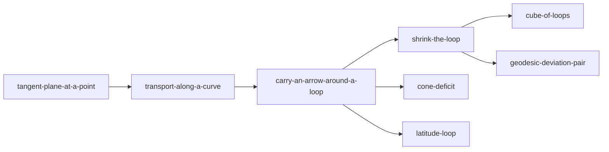

# Carry an arrow around a loop

`carry-an-arrow-around-a-loop` · visual · interactive 3D · **flagship**

## What it makes visible

An arrow moved without twisting comes back turned on a curved surface, and not on flat or merely bent ones. The turn
tracks enclosed area and orientation. It is the single picture behind parallel transport, path dependence, holonomy,
Gaussian curvature, and the meaning of the Riemann tensor.

## The picture

The same composition works as a static card, a 2D widget and a 3D scene:

- **Surface**, shaded, with a light intrinsic grid.
- **Loop** drawn on it, with its enclosed region tinted and a small orientation arrow.
- **Ghost trail** of the transported arrow at regular steps. The arrow never visibly spins *relative to the surface*.
- **Tangent-plane inset** at the base point: the starting arrow in grey, the returned arrow in the accent colour, and an
  arc marking the angle between them.
- **Readouts**, shown only when the loop closes: turn angle, enclosed area, area/R², and angular excess for triangles.

## Interaction

| Control | Effect |
| --- | --- |
| Surface: plane · cylinder · sphere · saddle · cone | Controls first, then curvature of either sign, then curvature concentrated at a point |
| Presets: octant triangle · latitude circle · two routes to a point | The canonical cases, one click each |
| Drag vertices / sketch a free loop | Area and shape change live |
| Reverse direction | Tint arrow and turn sign flip together |
| Radius slider (sphere) | Same-angle triangle keeps its turn; fixed-size triangle turns less |
| Scrub | Moves the arrow along the loop; the angle stays hidden until the loop closes |
| Unroll (cylinder, cone) | Side inset shows the flat sheet, where transport is sliding |

## Design rules that come from misconceptions

- **Never show a running angle.** Arrows at different points have no meaningful comparison.
- **Plane and cylinder always sit one click away** so "the surface is bent" can't be the explanation.
- **Reversal must be visibly symmetric**: the same loop, a mirrored tint arrow, and the opposite turn.
- On the cone, **loops that miss the tip come back clean.** That is the whole lesson, so it should be the easiest thing to try.

## Physics model and tests

Intrinsic transport ODE $\dot V^\rho + \Gamma^\rho{}_{\mu\sigma}\dot x^\mu V^\sigma = 0$ in surface coordinates, RK4.
Test cases:

- Octant = π/2.
- Latitude circle = $2\pi(1-\cos\theta_0)$.
- Plane and cylinder = 0.
- Cone loop around the tip = deficit angle.
- Arrow length is conserved to 1e-9.
- Reversal gives exactly the negative angle.

## Serves

| Concept | What it uses |
| --- | --- |
| parallel-transport | the trail and the no-twist rule |
| path-dependence-of-parallel-transport | the two-routes preset |
| holonomy | the returned arrow and the inset |
| gaussian-curvature, angular-excess | the area and excess readouts, and the saddle |
| riemann-curvature-tensor | handoff to *shrink-the-loop* |
| flatness-criterion | plane, cylinder and cone controls |

## In the visual network

## Starting material

The earlier course already has a strong implementation:

- **Geometry Lab 03:** transport model and scene. Port the model essentially as is.
- **Lab 05:** two routes. Fold it in as a mode.
- **The octant holonomy SVG:** use it as the no-WebGL fallback card.

To add: the saddle, the cone, the area plot, and the unrolled inset.
